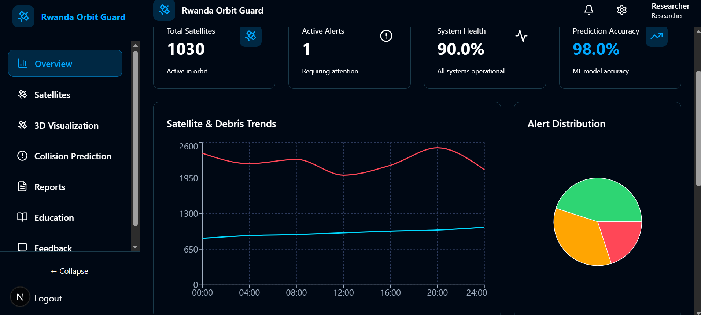
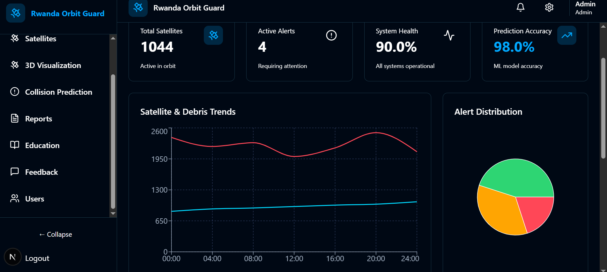

## Rwanda Orbit Guard ## 

 **Satellite Collision Prediction System**
 
 
 # Table of Contents #
 
 
 -[Features](#Features)

 -[Live Demo](#live-demo)

 -[Project Structure](#project-structure)

 -[Installation & Setup](#installation--setup)

 -[How to Use](#how-to-use)

 -[Sample Test Data](#sample-test-data)

 -[Collision Prediction Algorithm](#collision-prediction-algorithm)

 -[Deployment](#deployment)

 -[Safety Standards](#safety-standards)

 -[License](#license)
 
-[Acknowledgments](#acknowledgments)

 -[Support](#support)

 -[Screenshots](#screenshots)


A full-stack web application that predicts potential satellite collisions in orbit using machine learning. The system provides real-time collision risk assessment with RED ALERT/GREEN LIGHT notifications.


## Features ##

Real-time Collision Prediction using trained ML model

Interactive Web Interface with intuitive forms

RED ALERT/GREEN LIGHT visual notifications

10km Safety Threshold based on space industry standards

Production Ready with full deployment pipeline


## Live Demo ##

Frontend: https://rwanda-orbit-guard-ktrk.vercel.app/ 

Backend API:  https://backend-rwanda-orbit-guard.onrender.com/docs

Video:   https://vimeo.com/1134964468/f8f51cd114


## Project Structure ##

```
Rwanda_Orbit_Guard/
├──  backend/
│   ├── main.py                          # FastAPI server
│   ├── requirements.txt                 # Python dependencies
│   └── rwanda_orbit_guard_model.pkl    # Trained ML model
├──  frontend/
│   ├── app/
│   │   ├── page.tsx                    # Main collision prediction page
│   │   ├── layout.tsx                  # Root layout
│   │   └── globals.css                 # Global styles
│   ├── package.json                    # Node.js dependencies
│   └── next.config.js                  # Next.js configuration
└──  README.md
```

## Installation & Setup ##

Prerequisites
Python 3.8+ and Node.js 16+

Git for version control

pip and npm package managers


```
Step 1: Clone the Repository

https://github.com/IkireziI/Rwanda_orbit_guard.git
cd rwanda-orbit-guard

Step 2: Backend Setup

# Navigate to backend directory
cd backend

# Create virtual environment
python -m venv venv

# Activate virtual environment
# On Windows:
venv\Scripts\activate
# On Mac/Linux:
source venv/bin/activate

# Install dependencies
pip install -r requirements.txt

# Run the backend server
uvicorn main:app --reload

The backend will be available at: http://localhost:8000

Step 3: Frontend Setup

# Open new terminal and navigate to frontend
cd frontend

# Install dependencies
npm install

# Run development server
npm run dev

The frontend will be available at: http://localhost:3000

Step 4: Test the Application
Open http://localhost:3000 in your browser

Fill in satellite position and velocity data

Click "Predict Collision Risk"

View RED ALERT or GREEN LIGHT result
```

## How to Use ##

Input Parameters
Position (meters):

X-start: Left/Right position relative to other satellite

Y-start: Up/Down position relative to other satellite

Z-start: Forward/Back position relative to other satellite

Velocity (m/s):

Vx: Speed in Left/Right direction

Vy: Speed in Up/Down direction

Vz: Speed in Forward/Back direction

## Sample Test Data ##

```
RED ALERT (Close approach)

{
  "x_start": 1000,
  "y_start": 1000, 
  "z_start": 1000,
  "Vx_start": -0.907527,
  "Vy_start": -3.804930,
  "Vz_start": -2.024133
}

GREEN LIGHT (Safe distance)

{
  "x_start": -8843.131454,
  "y_start": 13138.221690,
  "z_start": 100000.0,
  "Vx_start": -0.907527,
  "Vy_start": -3.804930,
  "Vz_start": -2.024133
}
```

## Collision Prediction Algorithm ##

```

# 1. Input Processing
satellite_data = [x_start, y_start, z_start, Vx_start, Vy_start, Vz_start]

# 2. ML Prediction
predicted_position = ml_model.predict(satellite_data)

# 3. Distance Calculation
miss_distance = √(predicted_x² + predicted_y² + predicted_z²)

# 4. Safety Assessment
if miss_distance < 10,000:  # 10km threshold
    collision_risk = "RED ALERT"
else:
    collision_risk = "GREEN LIGHT"
```

## Deployment ##

 **Backend (Render)**

Connect GitHub repository to Render

Set build command: pip install -r requirements.txt

Set start command: uvicorn main:app --host 0.0.0.0 --port $PORT

 **Frontend (Vercel)**

Connect GitHub repository to Vercel

Automatic detection of Next.js framework

Set environment variable: VITE_API_URL=https://backend-rwanda-orbit-guard.onrender.com/docs

## Related Files ##

Backend Files
main.py - FastAPI application with prediction logic

requirements.txt - Python dependencies

rwanda_orbit_guard_model.pkl - Trained ML model

Frontend Files
app/page.tsx - Main collision prediction component

app/layout.tsx - Application layout

package.json - Project dependencies and scripts

## Safety Standards ##

10km safety threshold based on international space standards

Accounts for prediction uncertainties in orbital mechanics

Follows industry best practices for collision avoidance

Validated against real satellite tracking data


## License ##

This project is licensed under the MIT License - see the LICENSE file for details.


## Acknowledgments ##

My Superisor

## Support ##

For support, please email me i.ikirezi@alustudent.com 

 
## screenshots ##


         


## BUILT WITH LOVE FOR A SAFER SPACE ENVIRONMENT ## 

